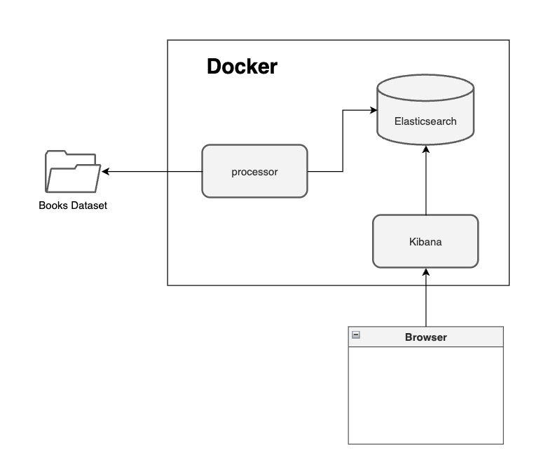

# Coding Challenge 01

The following challenge is designed to test basic programming skills, knowledge of NoSQL databases and  the fundamentals of LLMs. It is important to note that the candidate is not expected to fully master these technologies. Instead, the objective is to evaluate strategic thinking, problem-solving approach and  research skills.

The code must be developed by the candidate. Tools for generating code cannot replace the candidate’s ownership of the implementation. However, generative AI tools may be used to support the research phase of this exercise if necessary.

## System Requirements

To complete this exercise, the candidate must have access to a computer with at least 8 GB of RAM and with Docker and Docker Compose installed. It is recommended to install [Docker Desktop](https://docs.docker.com/desktop/setup/install/). If the candidate has no prior experience with these tools, the exercise may take approximately four hours to complete.

## Coding Exercise

The objective of this exercise is to process a set of JSON files representing book data. The JSON files are located in the `data/books` directory. The `description` field must be split into chunks and embeddings must be generated for each chunk. These embeddings should then be added to the JSON document. Once the document is prepared, it must be indexed into Elasticsearch.

After the documents are indexed in Elasticsearch, the user can access Kibana at [http://127.0.0.1:5601](http://127.0.0.1:5601) to perform semantic searches. The following image illustrates the architecture of this coding exercise:



### Steps

1. Explore all files in the ZIP archive, especially the `data/books` folder, to become familiar with the structure of the JSON files.
2. Complete all `TODO`s located in the file `processor/src/app.py`.
3. Create a set of semantic search queries to demonstrate the functionality of the system. This corresponds to the last `TODO` in the file
4. To run this exercise, execute:

```bash
docker compose up --build
```

5. Check the logs to ensure that your code is working correctly.
6.  Visit [http://127.0.0.1:5601](http://127.0.0.1:5601) and verify that the index has been created and that the books are available. Perform several semantic searches to validate the results.


### Optional

Refactor the code in `processor/src/app.py`, ensuring it is efficient and uses batching to improve performance.
Create a UI to interact with the system.
